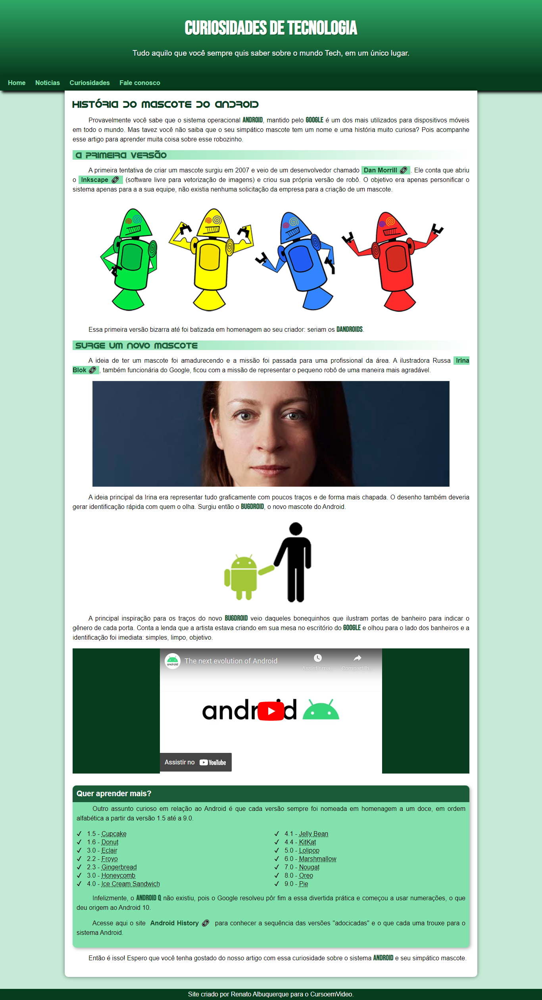

# Projeto Android - Prof. Gustavo Guanabara.

## Desafio 10 - Curso HTML5 e CSS3

Projeto construído durante o curso de HTML5 e CSS3, módulo 2 de 5, em Ago/22.

🔗 [Clique aqui para acessar](https://renato-albuquerque.github.io/PROJETO-ANDROID/)

## Tecnologias

- HTML5
- CSS3
- Git e Github

## Contato

🔗 [Linkedin](https://www.linkedin.com/in/renato-malbuquerque/)

